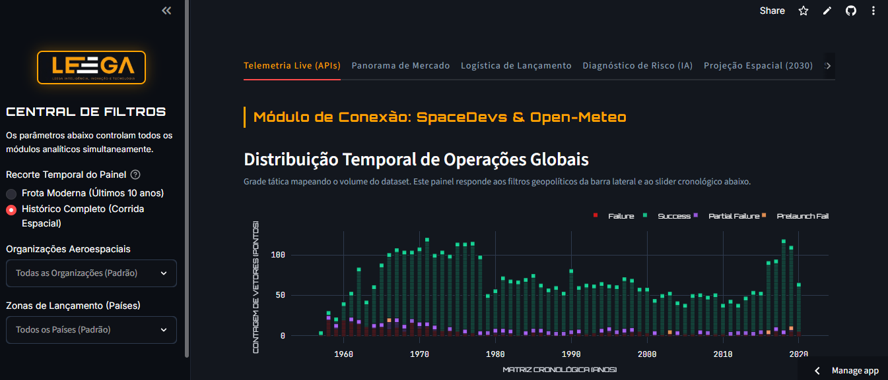
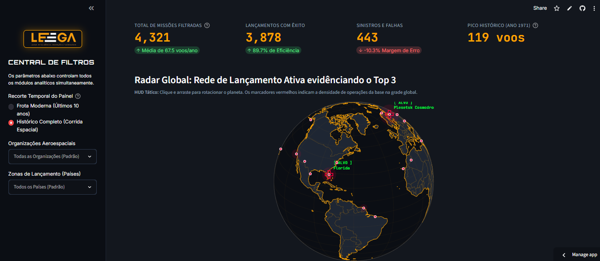
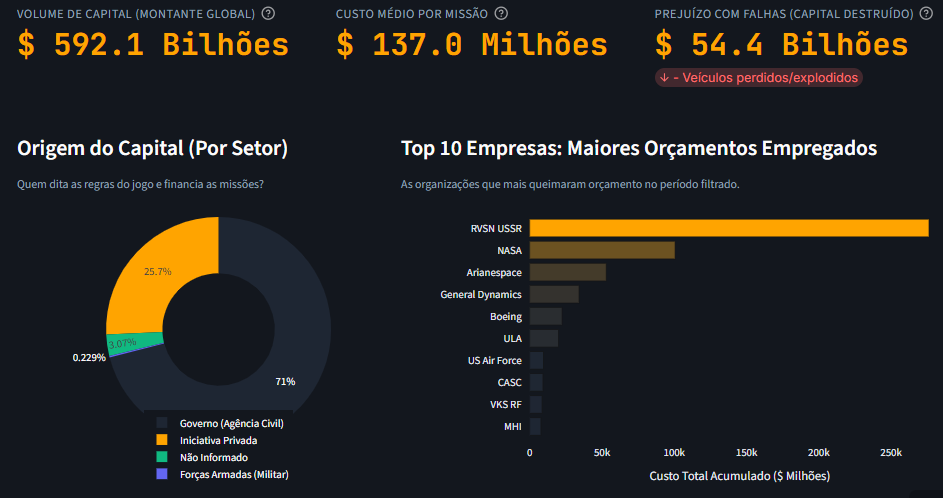
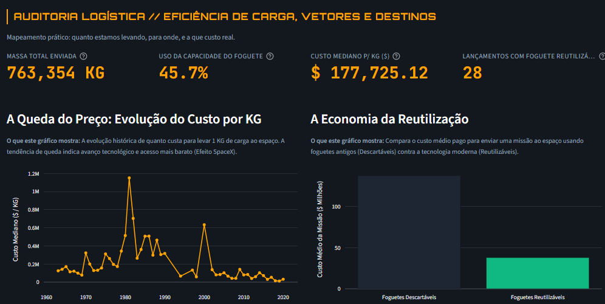
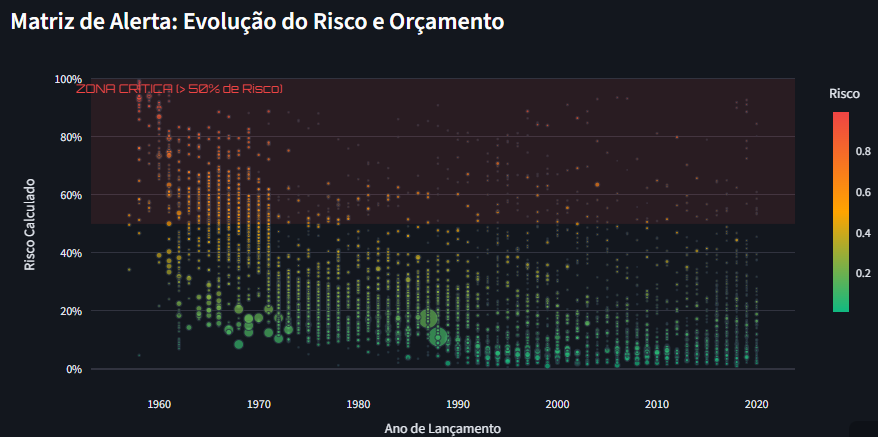
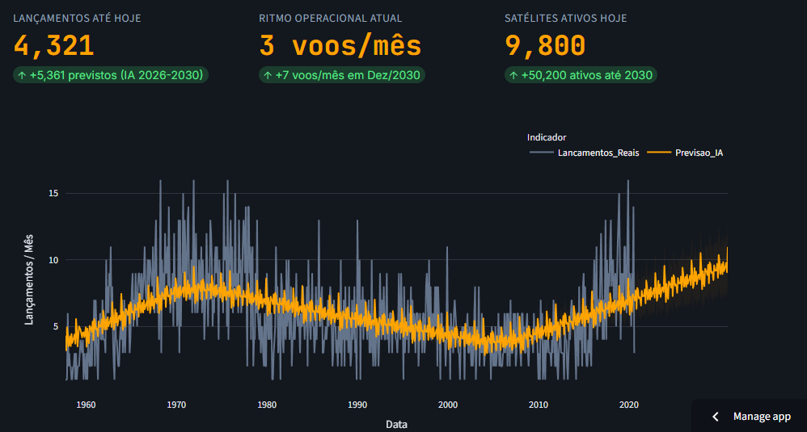

#  Dashboard de Controle de Missão Aeroespacial

Uma plataforma integrada de Inteligência Preditiva e Análise Macroeconômica do Setor Aeroespacial, construída com Python e Streamlit. Este projeto audita a viabilidade, a logística e os riscos de lançamentos de foguetes, além de monitorar telemetria ao vivo.

## 📸 Telas do Projeto

### Telemetria Live e Matriz Cronológica


### Radar Global (Infraestrutura LEO)


### Performance Financeira e Market Share


### Logística e Custo de Lançamento


### Motor de Decisão IA e Matriz de Risco


### Projeção Preditiva (Macro Forecast 2030)


##  Funcionalidades

O sistema é dividido em 6 módulos principais de análise:

* **Telemetria Live (APIs):** Conexão em tempo real com a API SpaceDevs para interceptar alvos de lançamento e com a Open-Meteo para dados meteorológicos (temperatura, umidade e precipitação) com animações CSS.
* **Panorama de Mercado:** Métricas consolidadas, taxa histórica de sucesso, market share (Shark Tank espacial) e renderização de um radar global (Globo 3D interativo).
* **Logística de Lançamento:** Eficiência de carga embarcada, custos medianos por KG, economia de veículos reutilizáveis e destinos orbitais mais frequentes.
* **Diagnóstico de Risco (IA):** Motor preditivo treinado com Random Forest (com balanceamento SMOTE) para avaliar a probabilidade de falha com base em fatores cronológicos, financeiros e geográficos.
* **Projeção Espacial (2030):** Análise preditiva de séries temporais projetando o volume do tráfego em órbitas baixas (LEO) até o final da década.
* **Simulador de Viabilidade:** Ferramenta interativa para calcular o risco estatístico e a exposição de capital de missões futuras através de dados hipotéticos informados pelo usuário.

##  Tecnologias Utilizadas

* **Front-end / Framework:** Streamlit (com injeção customizada de CSS)
* **Manipulação de Dados:** Pandas, NumPy
* **Visualização de Dados:** Plotly Express & Plotly Graph Objects
* **Machine Learning:** Scikit-Learn (RandomForestClassifier, OrdinalEncoder) & Imbalanced-Learn (SMOTE)
* **Integrações Externas (APIs):** Requests (The SpaceDevs API v2.3.0 & Open-Meteo)

##  Estrutura de Arquivos Necessária

Para que a aplicação funcione corretamente, certifique-se de ter os seguintes arquivos e diretórios na raiz do projeto:

```text
etl-foguetes-satelites/
├── app.py                   # Script principal do dashboard
├── requirements.txt         # Dependências do projeto
├── README.md                # Documentação do projeto
├── data/                    # Diretório com os datasets (CSV)
│   ├── Data_Streamlit/      
│   │   ├── Space_Limpa_Com_Risco_Individualv3.csv
│   │   ├── Tabela_Cronologica_BI_2030.csv
│   │   └── Tabela_Importancia_Variaveis.csv
├── img/                     # Elementos visuais (Arquivos locais suportados pelo Streamlit)
│   ├── foguete.mp4          # Vídeo de carregamento
│   ├── leega.jpeg           # Logo da sidebar
│   └── orbita.mp4           # Vídeo da simulação orbital